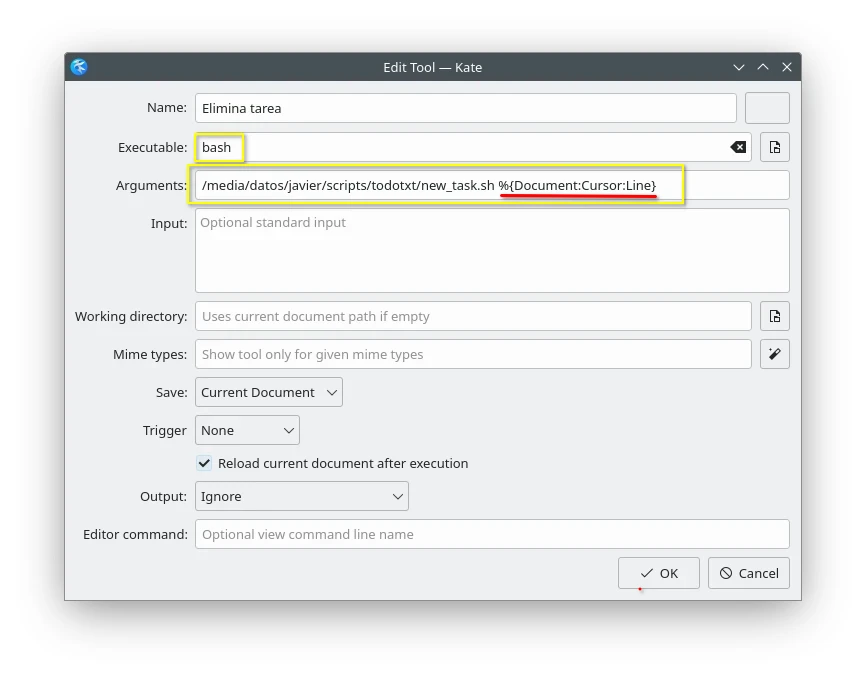
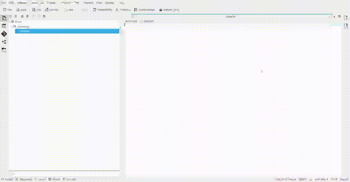

# Todo.txt in Kate
Bash scripts to manage a **todo.txt** system in **Kate** using the **"External Tools"** plugin.

## What is this?
These files are Bash scripts that can be configured as external tools and perform the following tasks using buttons and/or keyboard shortcuts.

Functions they can perform are:
- Create new To-do task
- Change priorities A/B/C
- Mark/unmark tasks as completed
- Archive tasks in a done.txt file

## External tools
The following configuration is required for the scripts to run correctly.

## Scripts working

## More info
For more information consult this page: [https://milangaelectrónica.com.ar](https://milangaelectronica.com.ar/posts/139-todotxt-kate/)
Please note that although it is in Spanish, it can be easily translated.
